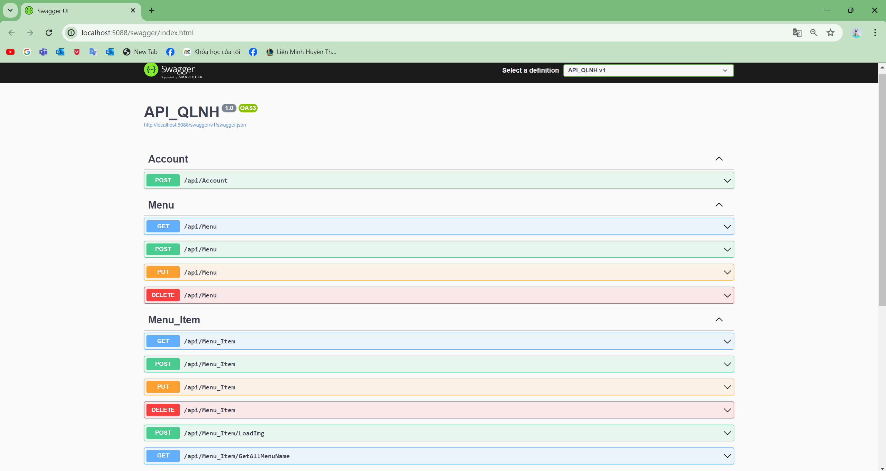
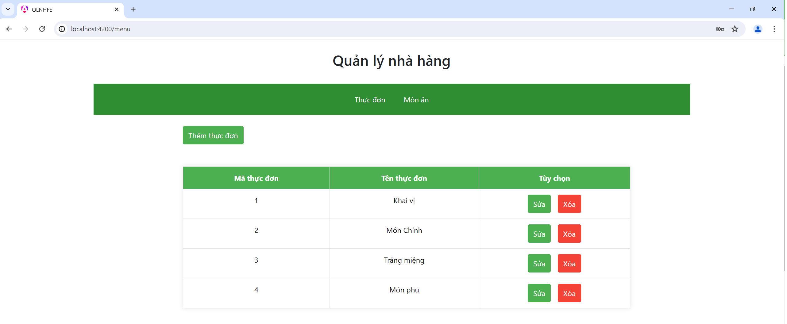
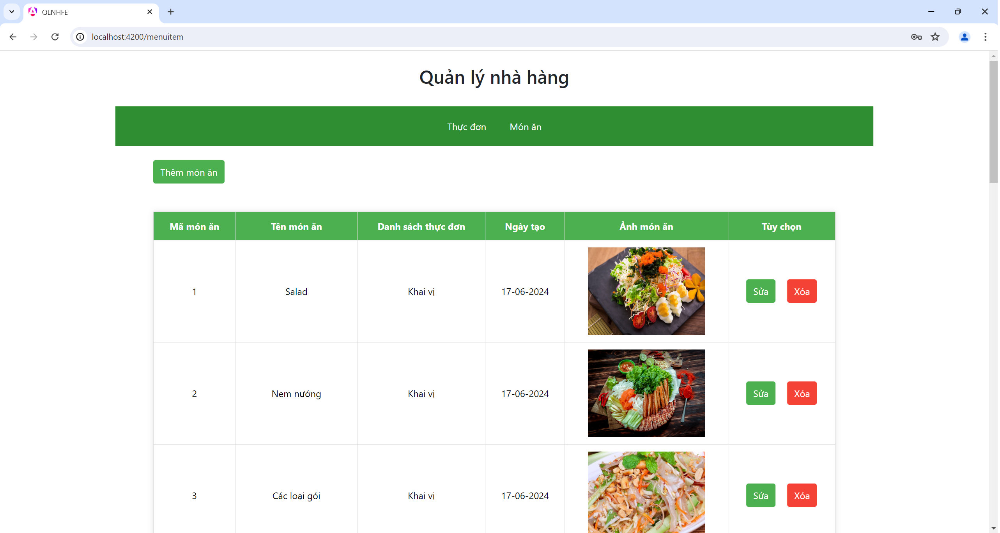

# API_QLNH

## Giới thiệu
QLNH là một API web quản lý nhà hàng với thực đơn và món ăn, được triển khai với Asp.net core 8.0 và xây dựng giao diện bằng Angular 18

# Các Chức Năng Chính
- Đăng nhập
- Xem, thêm, sửa xóa Thực đơn
- Xem, thêm, sửa, xóa Món ăn

## Yêu cầu để thực thi dự án
- Visual Studio 2022
- ASP.NET Core 8.0
- Angular 18/ NodeJS
- Visual Studio Code
- SQL Server 2019

## Cài đặt
1. Tạo dự án với ASP.NET Core Web API
- Truy cập vào dự án và mở Command Prompt
- Chạy dự án với: dotnet run
- Dự án sẽ được chạy trên: [localhost:5088](http://localhost:5088/ )
2. Tải và sử dụng Angular
- npm install -g @angular/cli
- Truy cập vào dự án và mở Command Prompt
- Tạo dự án mới: ng new project-name --no-standalone
- Tạo component: ng generate component name
- Chạy Angular: ng serve
- Angular sẽ được chạy trên: [localhost:4200](http://localhost:4200/ )

## Giao diện
Giao diện API

Thực đơn

Món ăn

## Tình trạng dự án
Đã hoàn thành

## Liên hệ
[Minh Triều](https://github.com/mt276)
